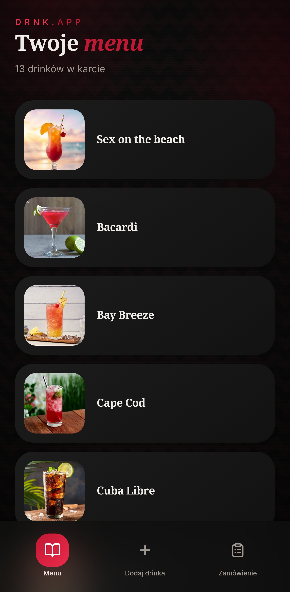
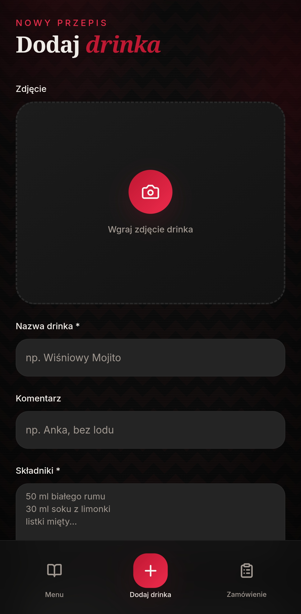
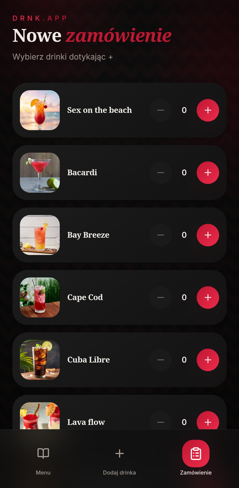
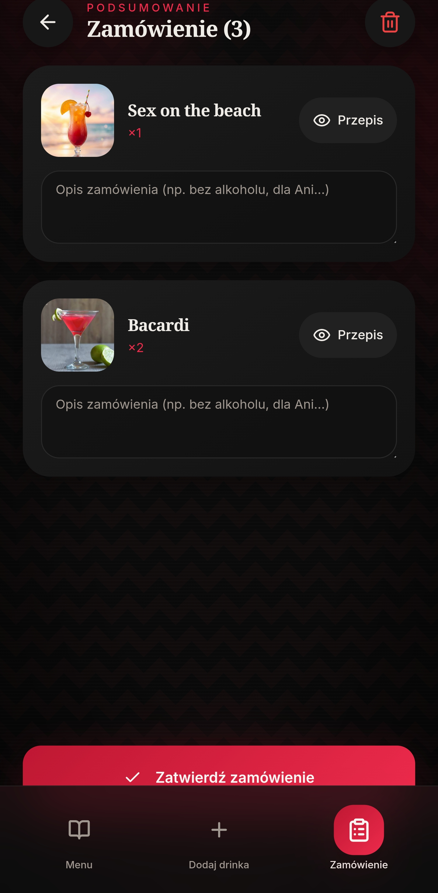

# 🍸 DRNK.app — Twoje Menu Drinków

Mobilna aplikacja na Androida stworzona dla pasjonatów koktajli lub pospolitych kustoszy przeróżnych mieszanek. Pozwala zarządzać listą ulubionych drinków i mieć przepisy zawsze pod ręką.

## Funkcje
* **Menu Główne:** Szybki podgląd drinków z miniaturkami
* **Szczegółowe Przepisy:** Pełna lista składników i instrukcje po kliknięciu w zdjęcie.
* **Dodawanie:** Formularz pozwalający na bieżąco rozbudowywać bazę koktajli.

## Instalacja (Android)
Pobierz plik `app-debug.apk` z folderu `android/app/build/outputs/apk/debug` i zainstaluj na swoim telefonie.

## 📸 Screeny z aplikacji

  
  
  
  

---
*Aplikacja przeznaczona wyłącznie dla osób pełnoletnich.*
